# 鲲鹏（Kunpeng）

[](LICENSE)

> 一套在真实商业短片项目里打磨出来的 AIGC 视频 Agent——从 AI 剧本、画布、流水线工坊到智能剪辑，全链路一站式，本地运行，完全开源。

鲲鹏是一款基于 Tauri（React + Rust）的 macOS 桌面应用。它最初是一个人为拍片自用的内部工具：团队多条百万赞、十多条十万赞级的 AI 短片全部由它产出，之后一边批量接商业项目一边踩坑修复，把原型打磨成了这套可以商用落地的视频 Agent，现在完整开源。

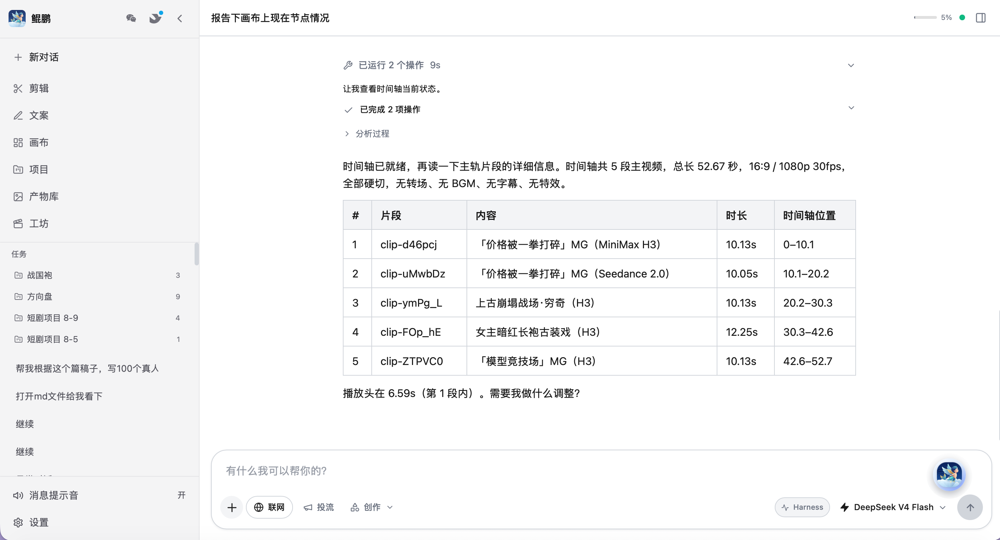

## 全链路功能

不是简单的一键生图、一键成片，而是从**剧本拆解 → 分镜预演 → 资产管理 → 提示词迭代 → 画面生成 → 后期剪辑**的全链路影视级工作台。所有项目、素材、成片、分镜、文案统一归档，一站式闭环。

### 普通对话：DeepSeek Harness + 国产大模型全家桶

- 对话编程（vibe coding）与 AI 内容创作两种日常模式，主界面参考 Codex 的交互逻辑。
- DeepSeek 完整对接 **DeepSeek Harness** 官方运行时（ACP/MCP 桥），可在 Harness 与内置模式间一键切换。
- 同时接入 **GLM-5.3 / Kimi K3 / MiniMax M3 / 通义 Qwen3.8 / 豆包 Seed 2.1**，全部走各家官方 Anthropic 兼容协议，自研 agent loop 统一调度、智能降级。

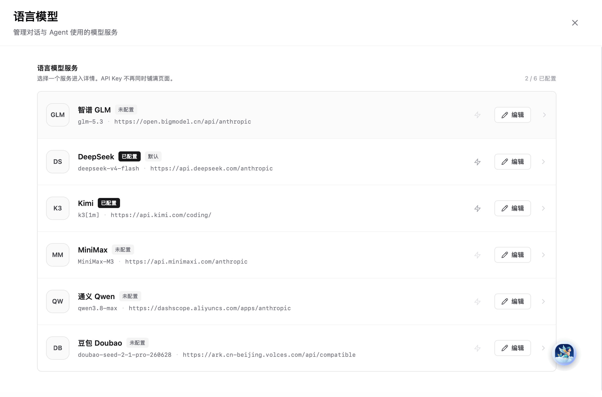


### 全能画布：主流画布能力全配齐

智能扩图、局部重绘、擦除物体、抠图去底、专业色卡、一键三视图、反推提示词，全部内置；画布支持全智能自动化操作——打开侧边 AI 助手，全程用自然语言指挥 AI 搭建画布、排布节点、优化画面结构。

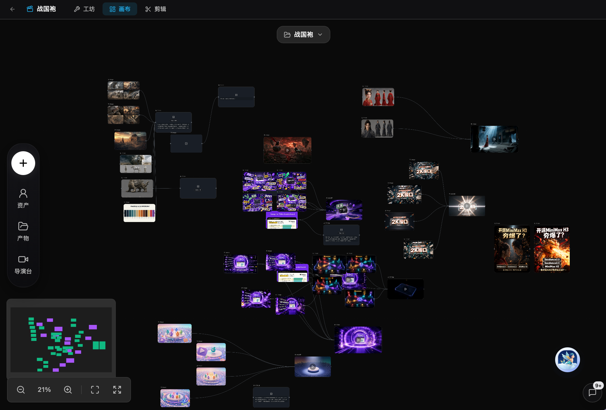

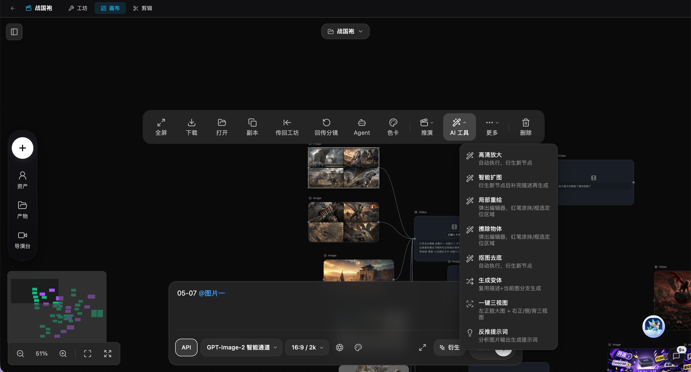

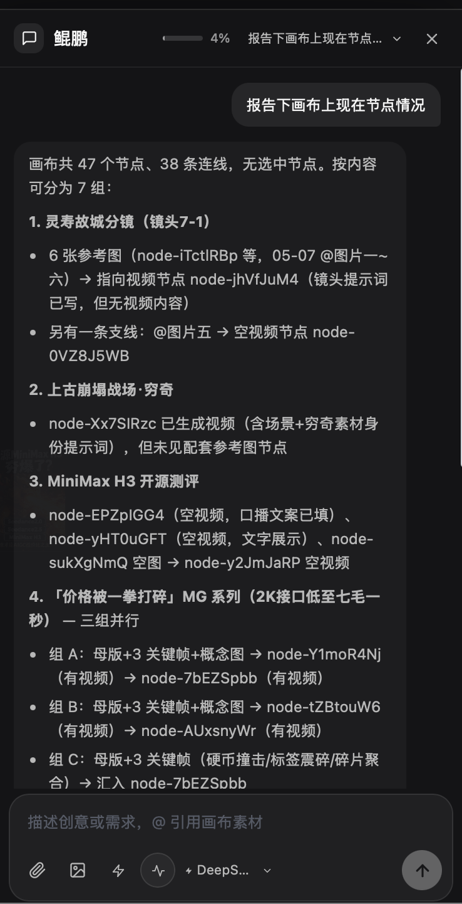

### 风格库：245 种一键风格

内置 **161 种 GPT 全系风格 + 84 种 Midjourney 专属风格**（附实测参数），自然语言描述即可一键匹配，免去手写复杂提示词的工作量。

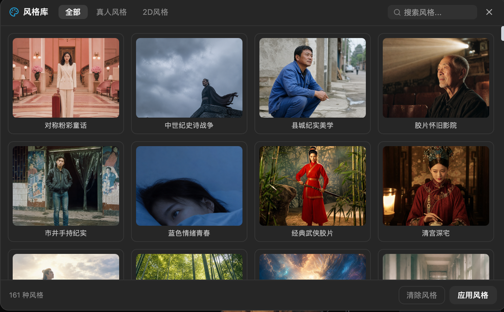

### 流水线工坊：打磨最久、使用率最高的核心

传统画布的痛点是项目一多资产就乱、节点线路密密麻麻。工坊模式把整个生产过程结构化：

1. 上传一篇完整剧本，AI 自动拆解剧情、拆分镜头、生成角色/场景资产图、输出每镜专属视频提示词，全自动跑通生产流水线；
2. 所有素材、图片、视频、台词、提示词以结构化表格规整呈现，可单独提取、单独修改、单独迭代；
3. 模块双向互通：流水线资产一键导入画布精修，画布调整完又回流流水线继续批量出片。

小白可以一键全自动出片，老手把它当专属的分镜库、素材库、提示词仓库。

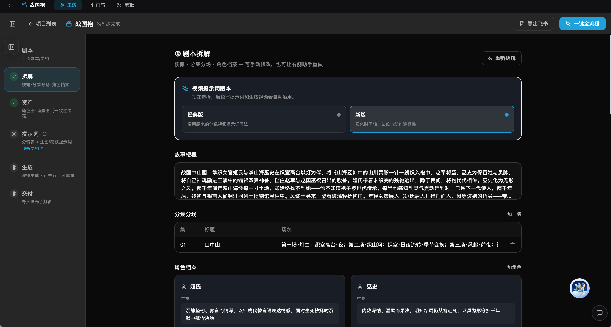

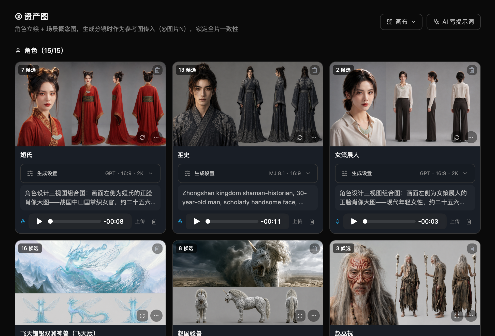

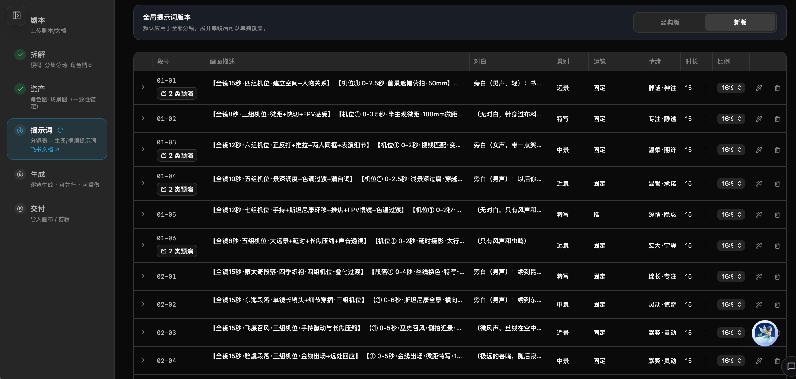

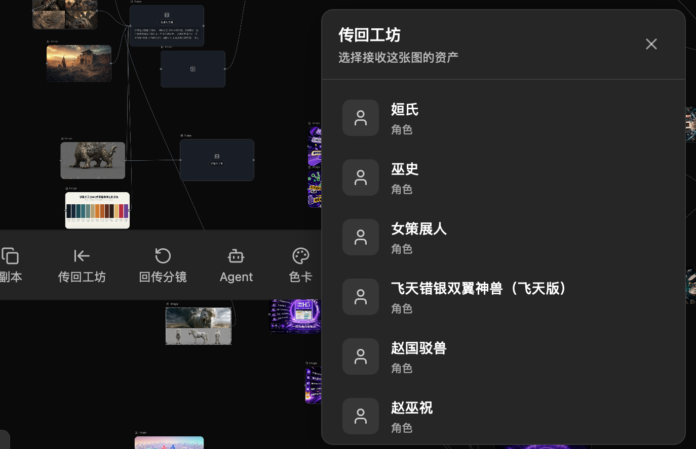

### 故事板与导演台白模预演

影视级项目工作台：自动读取剧本生成高清故事板（导演约束版、九宫格分镜版），镜头画面、表演细节、构图风格都可单独修改。内置**导演台白模预演**——先预演镜头调度与画面节奏，确认后再生成视频，大幅提升成片成功率。另内置两套顶配提示词模板，分别适配 Seedance 2.0 / 2.5 的模型质感。

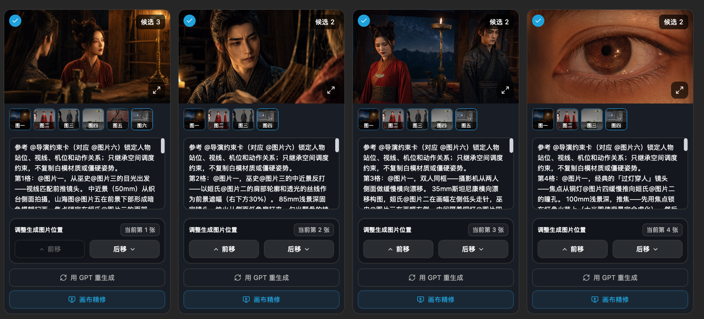

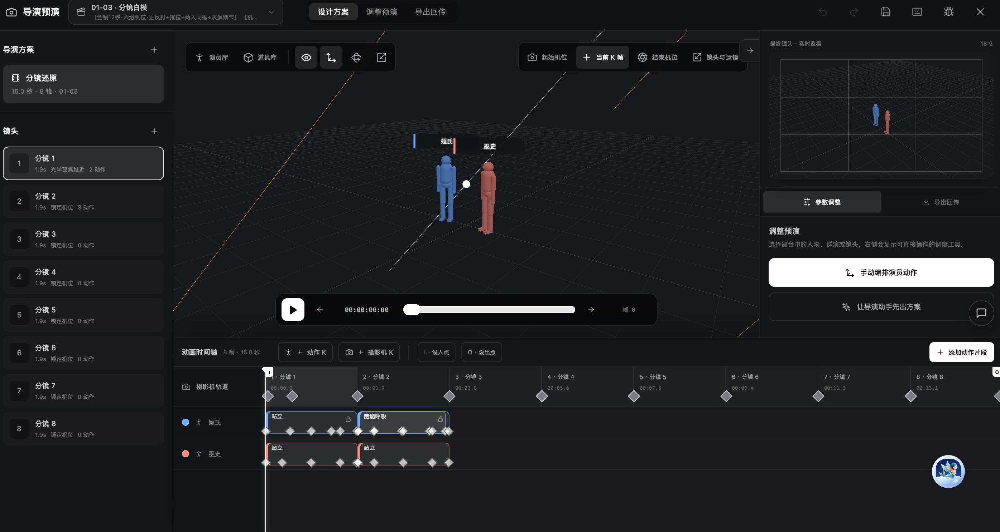

### 对话式 AI 剪辑（A 剪）与配音闭环

短视频口播或长篇剧情，都可以用对话指令完成剪辑：自动剔除口播水词、优化语句节奏。配音环节先用豆包精修配音，再导入工作流精准把控音画匹配。

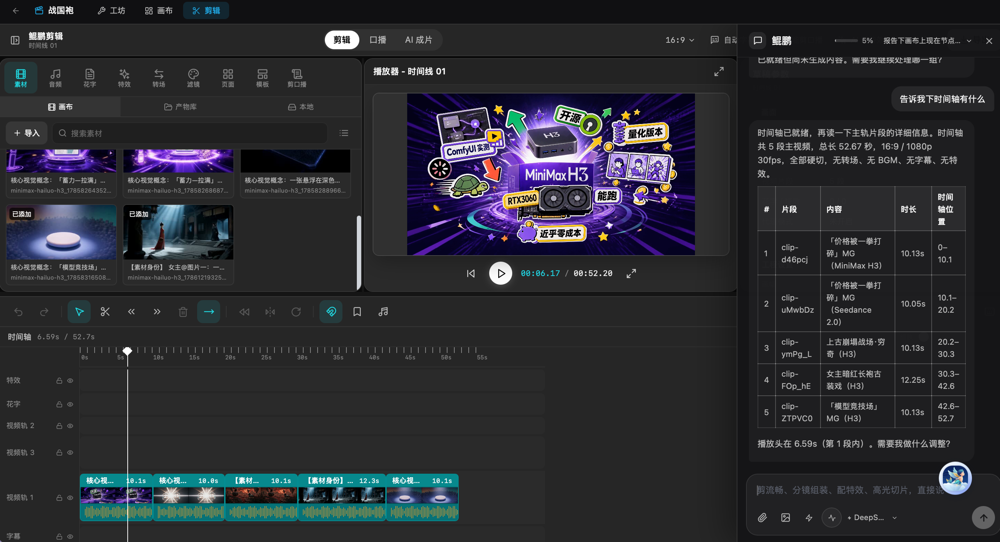

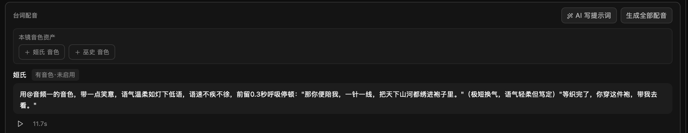

### MG 动画

HTML 页面动效 + MiniMax H3 / Seedance Mini / Omni 多引擎生成，画布内置 72 种 MG 风格预设，动画制作效率翻倍。

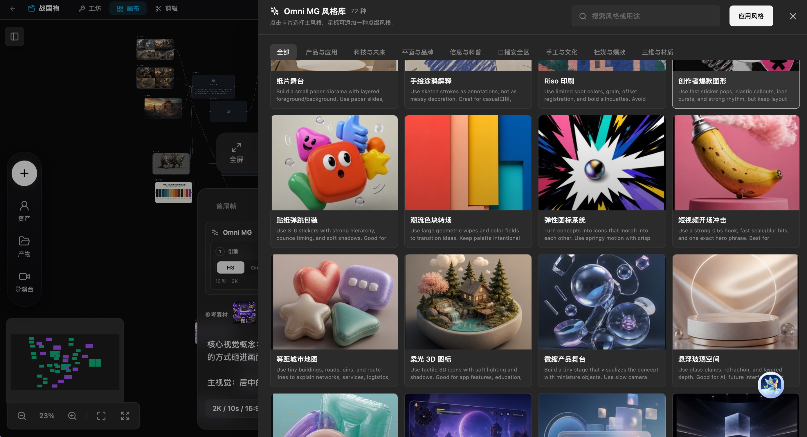

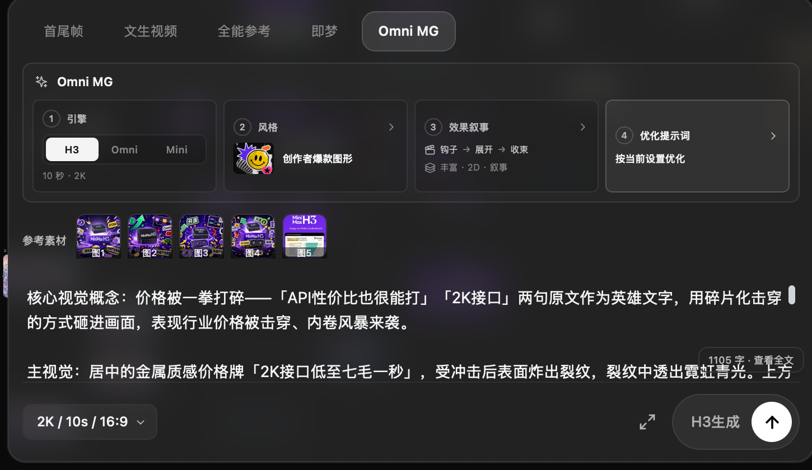

### AI 写作：去 AI 化审阅

内置自研的去 AI 化审阅模式，自动识别并优化 AI 写作的通病（生硬、模板化、空洞），配合按实战影视编剧规范打磨的编剧 Skill 系统。实话实说：AI 只能辅助规避问题，创意、审美、故事内核永远靠创作者自己——它能做的是洗掉文案的机器感。

### 开放与远程

- **极强的 API 拓展性**：生图/生视频/语音多渠道自由接入替换，新模型上线可第一时间适配——这也是当初坚持自研的核心原因。分镜方案可直接同步飞书给客户审核。
- **飞书 / 微信对接**：手机端远程操控、管理项目、调度创作，移动场景全适配。

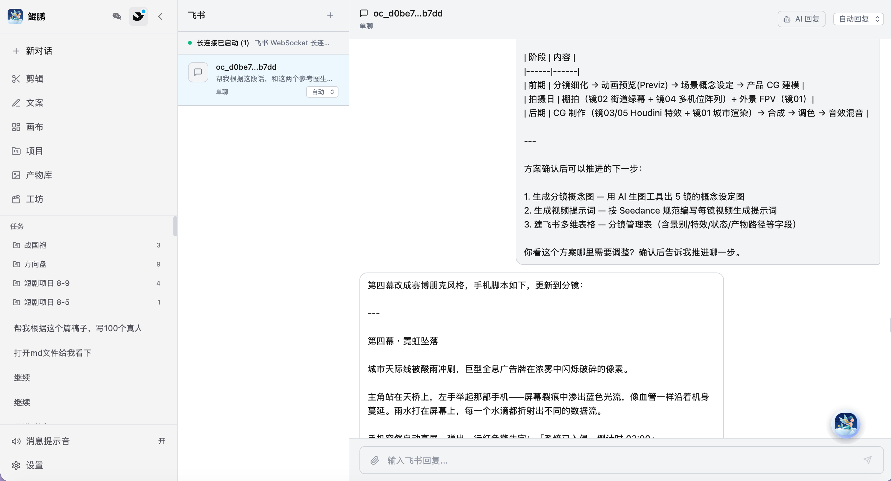

## 安装

### 下载安装包（macOS，Apple Silicon）

从 [Releases](../../releases) 页面下载最新的 `.dmg`，拖入「应用程序」即可。

> **未签名应用的 Gatekeeper 提示**：当前发布包未做 Apple 开发者签名，首次打开可能提示「无法打开，因为无法验证开发者」或「已损坏」。解决方法二选一：
>
> 1. 在 Finder 中**右键点击应用图标 → 打开**，在弹窗中再点「打开」；
> 2. 进入 **系统设置 → 隐私与安全性**，在底部找到鲲鹏的拦截记录，点「**仍要打开**」。
>
> 如提示「已损坏，移到废纸篓」，可在终端执行 `xattr -cr /Applications/鲲鹏.app` 后重试。

## 5 分钟上手

1. **获取 DeepSeek API Key**：前往 <https://platform.deepseek.com> 注册并创建 API Key。
2. **首次启动引导**：按引导填入 API Key 即可完成基础配置（每一步都可跳过，之后在设置里随时补配）。
3. **跑第一条任务**：在对话窗口输入一句需求，例如「帮我把这张参考图做成 15 秒的口播视频分镜」，观察 Agent 调用工具、产出结果的全过程。

## 配置

### 对话模型

| 渠道 | 说明 | 备注 |
| --- | --- | --- |
| DeepSeek | 默认推荐，走内嵌 DeepSeek Harness 引擎 | 需 API Key（platform.deepseek.com） |
| GLM（智谱） | GLM-5.3 / 5.2，Anthropic 兼容协议 | 需 API Key |
| Kimi（Moonshot） | K3 系列，原生视觉与 1M 长上下文 | 需 API Key |
| MiniMax | M3 / M2.7 / M2.5，1M 上下文 | 需 API Key |
| 通义 Qwen | qwen3.8-max 等，百炼 DashScope | 需 API Key |
| 豆包 Doubao | Seed 2.1 Pro，火山方舟 | 需 API Key |

### 图像 / 视频 / 语音生成渠道

| 渠道类型 | 说明 | 备注 |
| --- | --- | --- |
| 视频生成 | Seedance 2.0/2.5（筷子丽帧 / RunningHub / 火山方舟三通道可选）、MiniMax H3（RunningHub / APIMart 双渠道容灾）、Omni MG、即梦本地 CLI | 部分渠道**需自行配置密钥** |
| 图像生成 | Seedream 系、GPT-Image 系、Midjourney 系等 | 部分渠道**需自行配置密钥** |
| 语音 / ASR | 豆包语音（筷子丽帧 / 官方双通道） | 需自行配置密钥 |

> **第三方渠道声明**：第三方渠道为用户自配，本项目不担保其可用性与价格；所有内置渠道列表仅为开发时的接入选项，**不构成任何商业推荐**。你可以自由修改源码接入、替换或移除任何兼容的 API 服务。

## 适合谁 / 不适合谁

**适合**：有一定基础的创作者、开发者、工作室——可以把模块嵌入自己的 Agent、改造自有工作流、自主新增 API 接口；能接受自主微调、自行修复小 BUG、想深耕 AIGC 工作流的人。

**不适合**：完全不懂编码、不了解 Codex、没有基础 AI 工作流认知、只想零折腾上手即用的用户——市面商业成品工具有专业团队持续运维，会是更好的选择。

## 已知边界（实话实说）

- **目前只有 macOS 版本**（Apple Silicon 为主）。Windows 移植难度较高暂未实现，欢迎有兴趣的开发者一起共建。
- 项目从 2026 年 1 月由一名非专业程序员从零迭代而来，代码里难免有临时迭代的冗余和「屎山」；但经过大半年高强度商用实战，稳定跑项目、批量出片没有问题。
- 内置 AI 精细剪辑能力仍有局限，商用高精度成片建议外接专业剪辑软件处理。
- 团队核心重心是自有内容创作，很难逐一响应外部 BUG 反馈和新增需求；Issue 会尽力回应，更欢迎 PR 共建。

## 从源码构建

环境要求：Node.js 24+、Rust 工具链（rustup）、macOS。

```bash
# 安装依赖
npm install
npm ci --prefix dsh-runtime
npm run setup:dsh-node   # 下载内嵌 Node 运行时（gitignored，首次构建需要）

# 开发模式（热更新）
npm run tauri:dev

# 打包（公共构建为纯净版，不含任何私人资源）
npm run tauri:build
```

常用测试：`npm run test:harness`、`npm run test:dsh-runtime`、`npm run test:omni`、`npm run test:context`；Rust 侧：`cargo check --manifest-path src-tauri/Cargo.toml`。

## 架构简图

```
┌──────────────────────────── 前端（React）────────────────────────────┐
│  对话 / 画布 / 工坊 / 剪辑 / 文案                                     │
│        │                                                            │
│     useAgent（对话编排 Hook）                                         │
│        │                                                            │
│   模型路由（providers/router）                                        │
│     ├── GLM / Kimi / MiniMax / Qwen / 豆包 ── 自研 agent loop       │
│     └── DeepSeek ──────────── DeepSeek Harness 引擎                  │
│                               （dsh-runtime，ACP / MCP 桥）          │
└──────────────────────────────┬──────────────────────────────────────┘
                               │ Tauri IPC
┌──────────────────────────────▼──────────────────────────────────────┐
│   Rust 后端（src-tauri）：文件系统 / 命令执行 / 协议 / 系统集成        │
└─────────────────────────────────────────────────────────────────────┘
```

## 为什么开源

工具普惠时代，成熟的画布和工作流模板随处可见，Agent 与 Skill 的溢价也在被大模型原生能力快速吸收。真正拉开作品差距的从来不是工具，而是创作者的审美、判断力和品味。与其让这套工具闲置自用，不如彻底开放——让更多人免费使用、自主改造，也希望结识更多同赛道的创作者、开发者，一起共建 AIGC 生态。

## 参与贡献

欢迎 Issue 和 PR！请先阅读 [CONTRIBUTING.md](CONTRIBUTING.md)。行为准则见 [CODE_OF_CONDUCT.md](CODE_OF_CONDUCT.md)，安全问题报告见 [SECURITY.md](SECURITY.md)。

## 第三方声明与 License

- 本项目以 [MIT License](LICENSE) 开源。
- 第三方组件声明见 [THIRD-PARTY-NOTICES.md](THIRD-PARTY-NOTICES.md)（含 DeepSeek Harness、Node.js、sharp/libvips 等）。
- 更新记录见 [CHANGELOG.md](CHANGELOG.md)。
